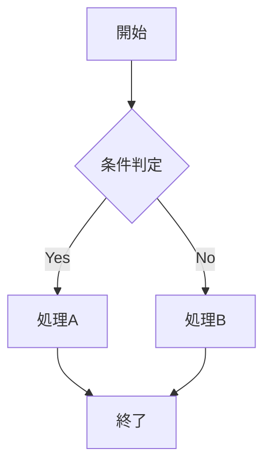
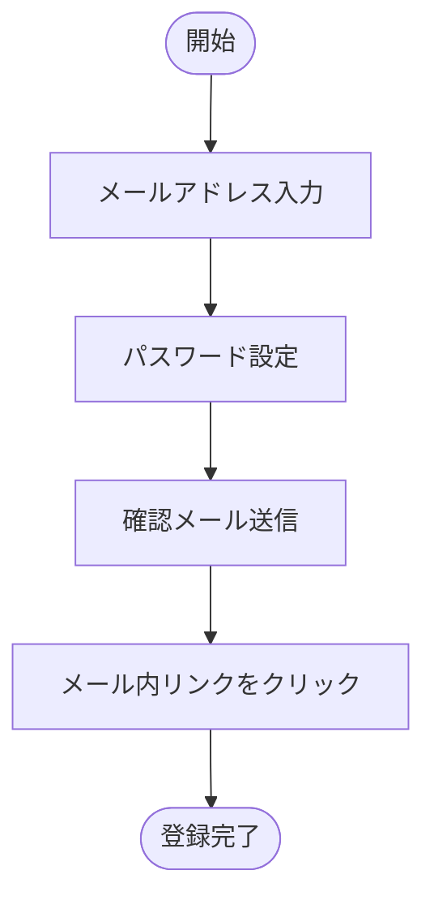
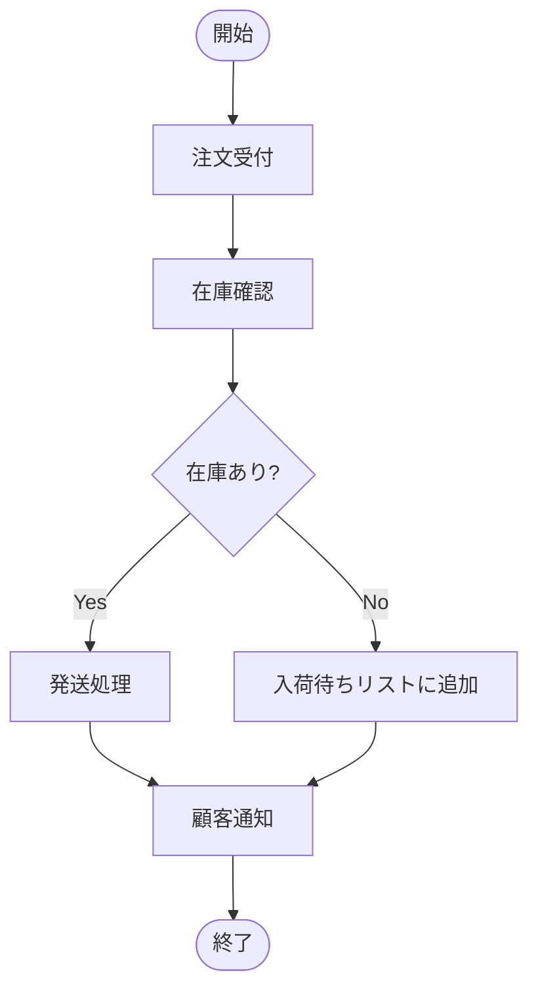

# Text to Flowchart

テキストファイルからフローチャート画像を生成します。

## 前提条件

- Node.js がインストールされていること
- 画像生成には以下のいずれかが必要：
  - **オプション1（推奨）**: `@mermaid-js/mermaid-cli` - ローカルで画像生成
    - インストール: `npm install -g @mermaid-js/mermaid-cli`
  - **オプション2**: インターネット接続 - mermaid.ink API経由で画像生成（外部依存なし）

## 実行手順

### Step 1: テキストファイルの読み込み

1. ユーザーから対象のテキストファイルパスを取得
2. ファイルの内容を読み込み、プロセスや手順を把握

### Step 2: フローチャート構造の分析

テキストから以下の要素を抽出：

- **開始点/終了点**: プロセスの開始と終了
- **処理ステップ**: 各アクションや操作
- **分岐条件**: 条件分岐（if/else、Yes/No）
- **ループ**: 繰り返し処理
- **並列処理**: 同時に行われる処理

### Step 3: Mermaid記法への変換

抽出した構造をMermaid記法に変換する。

#### 基本的なフローチャート記法



#### ノードの形状

| 形状 | 記法 | 用途 |
|------|------|------|
| 角丸四角 | `A([テキスト])` | 開始/終了 |
| 四角 | `A[テキスト]` | 処理 |
| ひし形 | `A{テキスト}` | 条件分岐 |
| 平行四辺形 | `A[/テキスト/]` | 入力/出力 |
| 円筒 | `A[(テキスト)]` | データベース |
| 六角形 | `A{{テキスト}}` | 準備/初期化 |

#### フロー方向

- `TD` / `TB`: 上から下
- `LR`: 左から右
- `RL`: 右から左
- `BT`: 下から上

### Step 4: Mermaidファイルの作成

1. `.mmd` 拡張子でMermaid記法ファイルを作成
2. ファイル内容の例：

```
flowchart TD
    Start([開始]) --> Input[/データ入力/]
    Input --> Validate{入力検証}
    Validate -->|有効| Process[データ処理]
    Validate -->|無効| Error[エラー表示]
    Error --> Input
    Process --> Output[/結果出力/]
    Output --> End([終了])
```

### Step 5: 画像の生成

2つのスクリプトから選択：

#### オプション1: mermaid-cli使用（推奨・オフライン動作）

```bash
node <skill-path>/scripts/generate_flowchart.cjs <input.mmd> <output.png>
```

- 高品質な画像生成
- オフラインで動作
- 要：`@mermaid-js/mermaid-cli`のインストール

#### オプション2: API使用（依存パッケージ不要）

```bash
node <skill-path>/scripts/generate_flowchart_api.cjs <input.mmd> <output.png>
```

- 追加パッケージのインストール不要
- インターネット接続が必要
- mermaid.ink APIを使用

#### 共通オプション

- 出力形式: `.png` または `.svg`（拡張子で自動判定）

### Step 6: 出力確認

生成された画像ファイルのパスをユーザーに報告。

## 使用例

### 例1: シンプルな手順書から

**入力テキスト**:
```
ユーザー登録の流れ：
1. メールアドレスを入力
2. パスワードを設定
3. 確認メールを送信
4. メール内のリンクをクリック
5. 登録完了
```

**生成されるMermaid**:


### 例2: 条件分岐を含む処理

**入力テキスト**:
```
注文処理：
1. 注文を受け付ける
2. 在庫を確認する
3. 在庫があれば発送処理、なければ入荷待ちリストに追加
4. 顧客に通知を送る
```

**生成されるMermaid**:


## 注意事項

- 複雑すぎるフローは複数の図に分割を検討
- ノード名は簡潔に（長い説明は別途ドキュメントで）
- 日本語テキストはフォント設定に注意
- 生成された画像は必要に応じて編集ツールで調整可能
